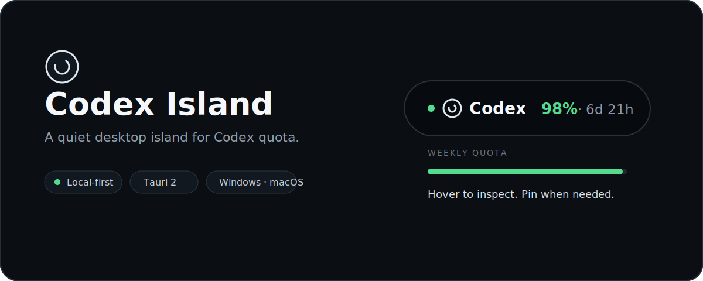
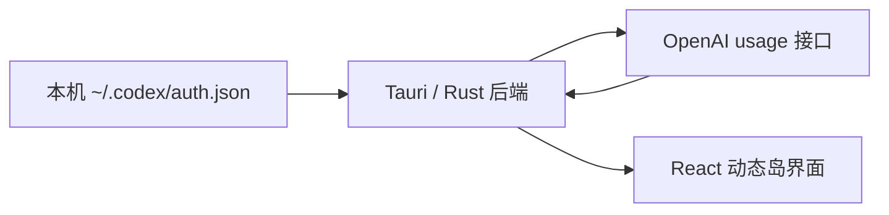

<div align="center">
  

  <p><strong>把 Codex 周额度放在桌面最顺手的位置。</strong></p>
  <p>复用本机登录态，无需重复登录；轻触胶囊即可查看套餐、剩余额度与重置时间。</p>

  <p>
    <a href="#快速开始">快速开始</a> ·
    <a href="#产品能力">产品能力</a> ·
    <a href="#工作方式">工作方式</a> ·
    <a href="#构建">构建</a>
  </p>
</div>

## 产品能力

| | 能力 | 体验 |
| --- | --- | --- |
| **01** | 顶部动态岛 | 剩余额度与倒计时常驻桌面顶部，悬停展开、离开收起 |
| **02** | 周额度识别 | 从服务端可用窗口中识别最长周期，避免把 7 天额度误标成短周期额度 |
| **03** | 渐进式提醒 | 额度颜色随余量变化；低额度时提供克制但明确的视觉提醒 |
| **04** | 创作流交互 | 支持锁定常驻、拖动定位、窗口透明度与全屏沉浸状态 |
| **05** | 系统级能力 | 系统托盘、开机启动、立即刷新和多语言切换 |
| **06** | 本地优先 | 登录令牌只在 Rust 后端内存中参与请求，不交给前端或第三方 |

## 快速开始

### 运行要求

- 已在本机登录 Codex，并存在 `~/.codex/auth.json`
- Node.js 20+
- Rust stable
- Windows 10/11（WebView2）或 macOS 11+

### 启动开发版

```powershell
pnpm install --frozen-lockfile
pnpm tauri dev
```

启动后，Codex Island 会出现在当前显示器顶部中央。将鼠标移入胶囊即可展开详情；托盘菜单提供显示、刷新、开机启动、语言切换和退出操作。

> [!NOTE]
> Codex Island 读取 OpenAI 服务端返回的额度状态，不会绕过或修改平台限额。服务端存在同步延迟时，界面会展示当时可读取的数据。

## 当前额度策略

当前 OpenAI 额度接口响应中只包含周额度窗口。Codex Island 会从服务端返回的可用窗口中选择周期最长者作为周额度，因此不会把 7 天额度误标成原来的 5 小时额度。

如果 OpenAI 后续恢复短周期窗口，项目中仍保留双额度映射与界面实现的恢复入口。

## 工作方式



| 模块 | 边界 |
| --- | --- |
| React / TypeScript | 胶囊、详情面板、交互状态与多语言文案 |
| Tauri / Rust | 登录态读取、额度请求、原生窗口与系统托盘 |
| OpenAI usage | 套餐、额度窗口和重置时间的数据来源 |

### 隐私边界

`~/.codex/auth.json` 只由本地 Rust 后端读取。访问令牌不会进入 React 状态、不会写入项目配置，也不会发送给 `chatgpt.com` 之外的服务。

## 构建

### Windows

```powershell
npm run tauri build
```

构建产物位于 `src-tauri/target/release/bundle/nsis/`。

### macOS

```bash
pnpm install --frozen-lockfile
pnpm tauri:mac
```

同时支持 Apple Silicon 与 Intel Mac 的 Universal 2 安装包：

```bash
pnpm tauri:mac:universal
```

macOS 的环境、签名与公证说明见 [docs/macos-build.md](docs/macos-build.md)。

## 项目结构

```text
codex-island/
├─ src/                    # React 界面与交互
├─ src-tauri/src/lib.rs    # 额度接口与桌面能力
├─ src-tauri/icons/        # 应用与托盘图标
├─ docs/                   # 平台构建说明
└─ _codex/                 # 项目上下文与维护决策
```

技术栈：`Tauri 2` · `Rust` · `React 18` · `TypeScript` · `Vite`

## 反馈

发现显示异常、额度字段变化或平台兼容问题，可以通过 [GitHub Issues](https://github.com/s840207702/codex-island/issues) 提交反馈，并附上系统版本和可复现步骤。
