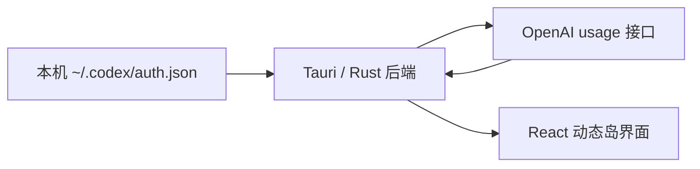

# Codex Island

一个安静驻留在桌面顶部的 Codex 额度动态岛：复用本机登录态，随时查看套餐、周额度与重置时间。

## 为什么是 Codex Island

- **一眼读完**：胶囊直接显示剩余额度和重置倒计时，悬停即可展开完整周额度面板。
- **不打断工作**：窗口始终置顶，支持自动收起、锁定常驻、拖动定位和全屏沉浸模式。
- **状态表达清晰**：额度颜色会随余量变化，低额度进入提醒状态；同步失败时保留上次成功数据。
- **本地优先**：直接读取本机已有的 Codex 登录态，不要求重复登录，也不把令牌交给前端或第三方服务。
- **桌面原生体验**：基于 Tauri 构建，提供系统托盘、开机启动、多语言和窗口透明度控制。

## 快速开始

### 运行要求

- 已在本机登录 Codex，并存在 `~/.codex/auth.json`
- Node.js 20+
- Rust stable
- Windows 10/11（WebView2）或 macOS 11+

### 启动开发版

```powershell
npm install
npm run tauri dev
```

启动后，Codex Island 会出现在当前显示器顶部中央。将鼠标移入胶囊即可展开详情；托盘菜单提供显示、刷新、开机启动、语言切换和退出操作。

## 当前额度策略

当前 OpenAI 额度接口响应中只包含周额度窗口。Codex Island 会从服务端返回的可用窗口中选择周期最长者作为周额度，因此不会把 7 天额度误标成原来的 5 小时额度。

如果 OpenAI 后续恢复短周期窗口，项目中仍保留了双额度映射与界面实现的恢复入口。

## 工作方式



| 模块 | 职责 |
| --- | --- |
| `src/main.tsx` | 胶囊、额度面板、交互状态与多语言文案 |
| `src/overrides.css` | 动态岛布局、额度状态和细节动效 |
| `src-tauri/src/lib.rs` | 登录态读取、额度请求、窗口与系统托盘逻辑 |

访问令牌只在 Rust 后端内存中用于请求 `chatgpt.com`，不会写入前端状态、本地项目配置或第三方服务。Codex Island 不会绕过 OpenAI 的额度限制；界面显示的是服务端当时返回的状态。

## 构建

### Windows

```powershell
npm run tauri build
```

构建产物位于 `src-tauri/target/release/bundle/nsis/`。

### macOS

```bash
npm ci
npm run tauri:mac
```

macOS 的环境、签名与公证说明见 [docs/macos-build.md](docs/macos-build.md)。

## 技术栈

`Tauri 2` · `Rust` · `React 18` · `TypeScript` · `Vite`

## 反馈

发现显示异常、额度字段变化或平台兼容问题，可以通过 [GitHub Issues](https://github.com/s840207702/codex-island/issues) 提交反馈，并附上系统版本和可复现步骤。
